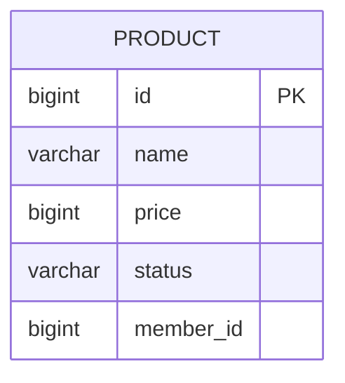

# E-Commerce Product Service

## 프로젝트 소개

**ecom-product**는 MSA 기반 이커머스 시스템의 상품 관리 서비스입니다.  
Spring WebFlux를 활용한 리액티브 프로그래밍과 마이크로서비스 아키텍처를 학습하기 위해 개발되었습니다.

---  

## 운영 URL

* 백엔드 URL : https://ecom-product-api.parkging.com
* API 문서 URL : https://ecom-product-api.parkging.com/apispec.html

---
## 주요 기능

### 상품 관리
- 상품 목록 조회
- 상품 정보 조회
- 상품 등록, 수정

### 인증/인가
- JWT 기반 토큰 인증
- Role 기반 접근 제어
- 회원의 Role이 판매자(SELLER)일 경우만 상품 관리 가능하도록 권한 검증
- 본인 정보만 접근 가능하도록 권한 검증

---  

## 기술 스택

### Backend
- **Java 21**
- **Spring Boot 3.5.11**
- **Spring WebFlux**
- **Spring Data R2DBC**
- **R2DBC MySQL**

### Database
- **H2** : 로컬 개발 (인메모리)
- **MySQL** : 운영 환경

### Security
- **JWT (java-jwt 4.4.0)** : 토큰 기반 인증
- **Jasypt** : 설정값 암호화
- **jBCrypt** : 비밀번호 해싱

### Infrastructure
- **Flyway**
- **Gradle**
- **Docker**
- **K3s**

### Documentation & Monitoring
- **SpringDoc OpenAPI**
- **Spring REST Docs**
- **Spring Boot Actuator**
- **Prometheus**

### Testing
- **JUnit 5**
- **Reactor Test**
- **REST Assured**

---  

## ERD


---  

## 프로젝트 실행

### 요구사항
- Java 21 이상

### 로컬 실행

1. **common 저장소 클론**
```bash  
git clone https://github.com/NG-Archive/ecom-common.git
```

2. **product 저장소 클론**
```bash  
git clone https://github.com/NG-Archive/ecom-product.git
```

3. **애플리케이션 빌드**
```bash  
./ecom-product/gradlew build
```  

4. **애플리케이션 실행**
```bash  
./ecom-product/gradlew bootRun
```  

### 테스트 실행

1. 테스트 실행
```bash  
# 전체 테스트 실행  
./ecom-product/gradlew test  
  
# 테스트 및 API 문서 생성  
./ecom-product/gradlew test openapi3  
```  

2. **API 문서 확인**
- OpenAPI Spec: http://localhost:8080/apispec.yaml  
